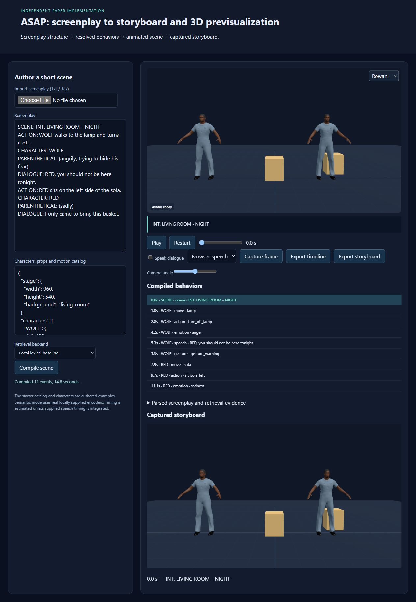

# ASAP for multi-outputs: auto-generating storyboard and pre-visualization with virtual actors based on screenplay

**Hanseob Kim, Ghazanfar Ali, Bin Han, Hwang Youn Kim, Jieun Kim, Hyemin Shin, Gerard Jounghyun Kim, Jae-In Hwang**

**Multimedia Tools and Applications · 2025** · Published

[Paper / publisher](https://doi.org/10.1007/s11042-024-19904-3) · [Project page](https://ghazanfarali.com/research/asap-journal/) · [BibTeX](citation.bib) · [Requirements](REQUIREMENTS.md) · [Code & setup](#implementation-and-usage)

> A screenplay becomes storyboards, animated previsualization, and immersive scenes.


*Original method figure from the ASAP journal paper: Figure 3, PDF page 8. Preparation and runtime phases of screenplay-driven previsualization; not a rendering result from this independent implementation.*

## Why this research

Turning a screenplay into a visual preview traditionally requires substantial animation and scene-authoring effort. ASAP interprets script structure and coordinates virtual actors to support early filmmaking decisions.

ASAP parses screenplay structure into characters, dialogue, actions, and emotions. Its modules select virtual actors and compose speech gestures, physical actions, facial expressions, and scene outputs. The journal expands the earlier ISMAR system and SIGGRAPH Asia live demonstration.

## Method at a glance

**Screenplay** → **Characters + actions + emotion** → **Storyboard / 3D / VR**

| | Research system |
|---|---|
| Input | A structured screenplay |
| Method | Screenplay parsing and coordinated character-behavior modules |
| Output | 2D storyboards, animated 3D previews, and immersive VR scenes |

## Evidence and scope

Reported top-1 action accuracy: 93% on simple sentences and 87% on complex sentences

**Attribution:** These findings describe the paper or manuscript, not results obtained with this repository's code.

**Study context:** Screenplay examples and action-sentence evaluation described in the paper.

**Limitations:** Animation coverage and scene composition depend on the available characters, actions, props, and environment assets.

## Explore the implementation

FDX/structured-script parsing, action and motion resolution, behavior timelines, SVG storyboards and schematic portable previews. Original Unity rendering, assets and benchmark results are not reproduced.

This repository contains independently written research code. The institute's original source, datasets and trained models are not distributed. Public-data preparation, commands, assumptions and checks are documented below and in [REQUIREMENTS.md](REQUIREMENTS.md).

## Resources and citation

Read the paper through its [publisher record](https://doi.org/10.1007/s11042-024-19904-3). PDFs are hosted by publishers or preprint archives rather than stored in this repository.

Please cite the research paper when using its ideas; [download the BibTeX citation](citation.bib). The implementation has its own documented scope.

<!-- demo-preview:start -->
## Demo preview



*Local demo with small starter examples; the capture illustrates the interface, not a reproduced paper benchmark.*

From the repository root, using the Python environment described below:

```sh
python -m pip install -e .
python -m pip install -r scripts/requirements-demo.txt
python scripts/start_demo.py
```

Open **http://127.0.0.1:8080/**. Click **Play** to run the preloaded screenplay, then **Capture frame** for the storyboard. The launcher prepares pinned Three.js modules and downloads one small official BEAT BVH/TextGrid sample on first run. It builds a nine-clip local bank and fits the Wild Pose Matching / GestureCLR-style adapter under ignored `outputs/beat-library/`; later runs reuse the cache. The first run needs internet access. Original recordings, large datasets, institute assets, and pretrained gesture weights are not distributed.

The 3D presentation uses shared Three.js avatar components and bundled fictional CC0 characters. The paper-specific algorithms and data adapters live in this repository.

The application uses `wild` retrieval for recorded co-speech motion: the journal paper's GestureCLR wild-pose matching lineage. The screenplay parser, action resolver, scene timeline, and storyboard capture remain this application's core. The BEAT preparation and retrieval dependencies are vendored in this repository, so no sibling repository checkout is needed. See `scripts/prepare_beat_demo.py` to rebuild the ignored local bank.

<!-- demo-preview:end -->

## Implementation and usage

<!-- implementation-guide -->

This repository turns a Final Draft `.fdx` file or a small structured screenplay into an auditable behavior timeline and three portable outputs: an SVG storyboard, an interactive schematic previz, and an immersive inspection page. It implements the paper's paragraph routing, dialogue/gaze/gesture, parenthetical emotion, and prop-oriented action sequence with offline lexical matching or local Sentence-BERT models.

**Citation.** Hanseob Kim, Ghazanfar Ali, Bin Han, Hwang Youn Kim, Jieun Kim, Hyemin Shin, Gerard Jounghyun Kim, and Jae-In Hwang. “ASAP for Multi-Outputs: Auto-generating Storyboard And Pre-visualization with Virtual Actors based on Screenplay.” *Multimedia Tools and Applications* (2025). [https://doi.org/10.1007/s11042-024-19904-3](https://doi.org/10.1007/s11042-024-19904-3). Status: published.

This is new public educational code. It is not the institute's original implementation and does not include its data, models, character/scene assets, Unity project, commercial plugins, or trained weights.

### Interactive quickstart

From this repository root, install the package, prepare the local viewer, and launch the browser demo:

```powershell
python -m pip install -e .
python scripts/prepare_viewer.py
python scripts/demo.py --port 8010
```

Open http://127.0.0.1:8010. The authored example compiles on load; edit the screenplay or import an FDX file, then play or scrub the timeline.

### Verify the included example

```powershell
python -m venv .venv
.venv\Scripts\Activate.ps1
python -m pip install -e .
python scripts/verify.py
start outputs/verify/storyboard.html
start outputs/verify/previz.html
```

The default backend is offline and deterministic: stemmed TF-IDF cosine for action combinations and stemmed keyword matching for emotions. For the paper's Sentence-BERT matching, see [Local Sentence-BERT models](#local-sentence-bert-models).

### Input schemas

Structured text uses one `LABEL: text` record per line. Supported labels are `SCENE`, `ACTION`, `CHARACTER`, `DIALOGUE`, and `PARENTHETICAL`. FDX input reads `Paragraph Type` plus nested `Text` elements. An optional `LANGUAGE: ko` line sets the language of the dialogue that follows. The library JSON contains `stage`, keyed `characters` (optional `aliases` and `language`), keyed `props` (instances with stand points, interaction points and sizes), and `actions`, the plausible combination dictionary described below. Older catalogs that list combinations under `motions` with `"kind": "action"` still load.

### Screenplay modules

- **Actions.** The library's `actions` list is the plausible action–object–position dictionary. Each entry has `id`, `verb`, `object`, `position` and `phrases`, plus optional `synonyms`, `effect` and `duration`. The subject is the character name nearest the start of the sentence, before the verb. Names match case-sensitively as whole words, so "The red lamp" does not select RED. A sentence without a name uses the most recent character and is marked `subject_source: "context"`. The paragraph is compared with every combination by cosine similarity. Regular-expression hints for verbs, prop classes and positions only veto contradicting combinations and supply verb evidence. A paragraph becomes a `narration` event, with no physical action, when it lacks a plausible combination or verb evidence, or scores below `resolver.action_threshold` (0.3 lexical, 0.45 Sentence-BERT). This is the left endpoint of the paper's Fig. 8. A Sentence-BERT paraphrase without a lexical verb must reach `action_paraphrase_threshold` (0.7).
- **Props.** Keys in `props` are instances. `class`, or the key without a numeric suffix, names the object class, so several lamps can coexist. The nearest instance to the actor's current position is chosen. When a prop has no positional anchors, `left`/`right` choose between instances. `anchor`, or a per-position entry in `anchors`, is the stand point the actor walks to. `interaction` is the `[x, y, height_m]` hand target, `size` is `[width, height, depth]` in metres, and `seat_height` is used for sitting. Without an anchor, the stand point is derived from the prop size plus 0.35 m clearance.
- **Emotion.** Parentheticals are scored against a keyword dictionary for anger, disgust, fear, neutral, joy, sadness and surprise; the library's `emotions` field can replace it. Each keyword implies a weak, medium or strong level. The offline path counts stemmed keyword hits. With a Sentence-BERT model, each emotion also adds its top three keyword cosine similarities above 0.25. Intensifiers such as "very" or "slightly" shift the level. Text without an emotional cue maps to neutral. Emotion events carry `emotion`, `level` (1–3) and per-emotion scores.
- **Manual expressions.** Append `[emotion: joy 2]` to any paragraph, or set `emotion_overrides` in the library, for example `{"3": {"emotion": "sadness", "level": 3}}` keyed by paragraph index. The demo's **Facial expression per paragraph** panel writes that field and recompiles.
- **Gaze.** A speaker looks at a character named in the line, otherwise at the centroid of the other characters. Speech events carry `gaze` and `gaze_point`.
- **Co-speech gesture.** Dialogue gestures are retrieved at playback from the local BEAT bank. **Export timeline** adds each speech event's played clip ids and retrieval route, plus a `played_gestures` list.
- **FDX.** Character extensions such as `(CONT'D)`, `(V.O.)` and `(O.S.)` are removed, and styled text runs are joined without inserted spaces.

### Local Sentence-BERT models

Semantic mode never downloads at compile time. Models load with `local_files_only=True`, once per server process, and embeddings are cached across compiles. The paper names `all-mpnet-base-v2` for gesture text and `multi-qa-mpnet-base-dot-v1` for actions; this implementation reuses `all-mpnet-base-v2` for the emotion keywords, because co-speech retrieval runs in the BEAT adapter. Save both models into the ignored `models/` folder once:

```sh
python -m pip install -e ".[semantic]"
python -c "from sentence_transformers import SentenceTransformer as S; [S('sentence-transformers/' + n).save('models/' + n) for n in ('all-mpnet-base-v2', 'multi-qa-mpnet-base-dot-v1')]"
```

In the demo, choose **Sentence-BERT** and enter `models/all-mpnet-base-v2` and `models/multi-qa-mpnet-base-dot-v1`. For the CLI, add the same folders to the library; relative paths resolve from the working directory:

```json
"resolver": {"backend": "sentence-transformer", "emotion_model": "models/all-mpnet-base-v2", "action_model": "models/multi-qa-mpnet-base-dot-v1"}
```

`timeline.json` is the canonical output. HTML files embed all JSON, CSS, SVG, and JavaScript and can be opened without a server. They are schematic planning artifacts and make no claim to reproduce the paper's Unity rendering, trained GestureCLR mapping, mocap library, commercial TTS/lip-sync, NavMesh/IK, 360 video, or hardware VR.

### Public data and model setup

The included screenplay and motion library are authored artificial fixtures for testing, not paper data. Use screenplays you own or public-domain scripts. Final Draft documents are user-provided; Final Draft is not required for the structured-text format. Build a motion catalog from motions you are licensed to redistribute. Keep downloads under ignored `data/`, `assets/`, `models/`, or `weights/` directories. No training is required for the offline baseline.

To swap in real inputs, keep the same labels in the screenplay (or use an `.fdx` file) and the same keys in `library.json`, then run `asap-multi path/to/screenplay.fdx --library path/to/library.json --out outputs/my-run`. The verify script and CLI call the same parser, compiler, and renderer.

See [REQUIREMENTS.md](REQUIREMENTS.md) for paper facts, implementation assumptions, and scope limits.

## Run the interactive 3D demo

From this repository root, with Python 3.10+:

```bash
python scripts/prepare_viewer.py
python scripts/demo.py --port 8010
```

Open http://127.0.0.1:8010. Edit the screenplay or import FDX, compile the scene, play/scrub its actual event schedule, inspect resolved actions/gestures and capture rendered storyboard frames. Characters are bundled fictional CC0 avatars; the starter action catalog is authored, while dialogue retrieves locally prepared BEAT body-motion clips. The browser renderer replaces the institute’s Unity/assets; it does not reproduce its motion library.

The default lexical matching runs without model downloads; [Local Sentence-BERT models](#local-sentence-bert-models) describes semantic mode. The scene catalog remains JSON: replace `characters`, `props` and `actions` to extend the demonstration. No dataset or model weights are included.

The journal demo exposes camera inspection, JSON schedule export and storyboard export. The ISMAR variant centers on scene playback and frame capture; the Live variant starts continuous playback after compilation. Neither earlier variant claims the journal’s full VR/360 outputs.

## Components and related implementations

The ASAP papers share screenplay parsing, action selection and coordinated speech/body/face behavior. The journal paper explicitly describes GestureCLR for 2D/3D gesture matching; see [Wild Pose Matching](https://github.com/ghazanPK/wild-pose-matching) and [Multilingual Gestures](https://github.com/ghazanPK/multilingual-gesture) for that component’s implementations. [Automatic Text-to-Gesture](https://github.com/ghazanPK/automatic-text-to-gesture) documents the earlier rule-mining approach. These research links identify component lineage; this standalone demo keeps the explicit user-authored action catalog and runs a vendored BEAT co-speech retrieval adapter from an ignored local bank, with no sibling repository checkout.

Related system variants: [ASAP journal](https://github.com/ghazanPK/asap-journal), [ASAP ISMAR](https://github.com/ghazanPK/asap-ismar), [ASAP Live](https://github.com/ghazanPK/asap-live).

## Optional local speech

Browser speech works immediately when enabled. For Kokoro, install `pip install -e ".[speech]"`, prepare local `config.json`, `kokoro-v1_0.pth` and `voices/af_heart.pt` from https://huggingface.co/hexgrad/Kokoro-82M, and set `KOKORO_MODEL_DIR` to that folder before starting the server. Prepare the English phonemizer dependencies described at https://github.com/hexgrad/kokoro (including espeak-ng where required). Choose Local Kokoro in the demo. Weights remain outside Git.

The replaceable speech adapter also supports CPU-INT8 faster-whisper with `WHISPER_MODEL_DIR` pointing to a locally obtained converted small model directory containing `model.bin`; `/api/asr` accepts raw audio and returns transcription plus word timestamps. The screenplay application primarily takes text/FDX. Speech adapters are engineering substitutions, not the papers’ original services.

<!-- avatar-recorded-motion:start -->
## Bundled characters and recorded public motion

The browser demos include Rowan and Mira, two new fictional GLB characters built with MPFB and MakeHuman community assets under CC0 1.0. See [avatar licensing and provenance](static/avatars/LICENSE.md). Use the character selector in the stage. The shared renderer supports body bones, ARKit facial channels, and approximate speaking motion.

Recorded motion is adapted to the characters' proportions. Palm landmarks set hand orientation; finger curl uses bounded hinge bends and preserves the character's finger spacing. Thumb-base opposition stays in the authored pose, with conservative recorded curl at the remaining joints. Distal bends are estimated from the preceding joint when fingertip landmarks are absent. Use the companion's hand close-up views to inspect the result.

The [avatar motion companion](static/recorded-motion.html) opens at `/recorded-motion.html` while the demo server is running. A small authored motion and face sample loads automatically; click **Play** without uploading files. It also plays locally selected BEAT motion, face, and WAV files on the bundled characters. These are presentation and data-inspection tools, separate from the paper implementation. No BEAT recording, dataset archive, or trained model is bundled. For recorded public motion, install the one preparation dependency and fetch a small official sample into ignored `outputs/beat-demo/`:

```sh
python -m pip install numpy
python scripts/beat_demo/fetch_modalities.py --speaker 1 --sequence 1_wayne_0_1_1 --include-bvh --max-bytes 25000000 --output-dir outputs/beat-demo/source
python scripts/beat_demo/prepare_bvh.py --bvh outputs/beat-demo/source/1_wayne_0_1_1.bvh --output outputs/beat-demo/sample/1_wayne_0_1_1-raw-motion.json --frames 120
python scripts/beat_demo/prepare_modalities.py --sequence 1_wayne_0_1_1 --source outputs/beat-demo/source --output outputs/beat-demo/sample --frames 120
```

Open the companion and select `outputs/beat-demo/sample/1_wayne_0_1_1-raw-motion.json`, `1_wayne_0_1_1-face.json`, and `1_wayne_0_1_1.wav`. The downloader caps each original file at 25 MB; the prepared clip contains up to 120 frames. The viewer uses local files and does not upload them. For other BEAT takes, substitute a matching official speaker and sequence ID.

If you already have OmniMo's processed 52-joint Unity humanoid data, use that normalized motion instead:

```sh
python scripts/beat_demo/prepare.py --dataset /path/to/processed/beat --speaker 1 --take 1_wayne_0_1_1 --output outputs/beat-demo/sample/1_wayne_0_1_1-motion.json --max-frames 120
```

Select the resulting `*-motion.json` in the companion. Its metadata carries the humanoid joint mapping and source-to-avatar coordinate conversion. The viewer fits source FK directions from the avatar's bind pose, following the spine explicitly at branching joints. This avoids applying incompatible source bone twist to the MPFB skin; it does not reproduce exact performer twist. The adapter supports Unity proximal/intermediate/distal finger names. Raw BVH remains a public-data alternative; do not mix the two skeleton conventions.
<!-- avatar-recorded-motion:end -->
