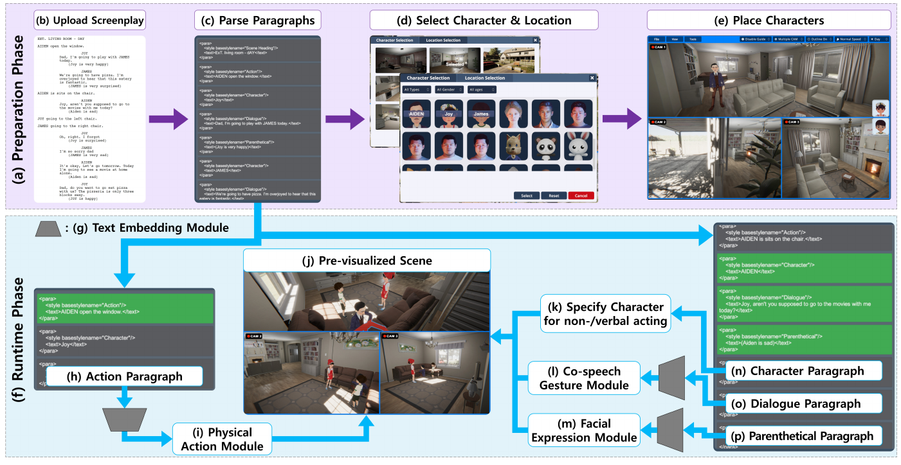

# ASAP for multi-outputs: auto-generating storyboard and pre-visualization with virtual actors based on screenplay

**Hanseob Kim, Ghazanfar Ali, Bin Han, Hwang Youn Kim, Jieun Kim, Hyemin Shin, Gerard Jounghyun Kim, Jae-In Hwang**

**Multimedia Tools and Applications · 2025** · Published

[Paper / publisher](https://doi.org/10.1007/s11042-024-19904-3) · [Project page](https://ghazanfarali.com/research/asap-journal/) · [BibTeX](citation.bib) · [Requirements](REQUIREMENTS.md) · [Code & setup](#implementation-and-usage)

> A screenplay becomes storyboards, animated previsualization, and immersive scenes.



*Original method figure from the ASAP journal paper: Figure 3, PDF page 8. Preparation and runtime phases of screenplay-driven previsualization; not a rendering result from this independent implementation.*

## Why this research

Turning a screenplay into a visual preview traditionally requires substantial animation and scene-authoring effort. ASAP interprets script structure and coordinates virtual actors to support early filmmaking decisions.

ASAP parses screenplay structure into characters, dialogue, actions, and emotions. Its modules select virtual actors and compose speech gestures, physical actions, facial expressions, and scene outputs. The journal expands the earlier ISMAR system and SIGGRAPH Asia live demonstration.

## Method at a glance

**Screenplay** → **Characters + actions + emotion** → **Storyboard / 3D / VR**

| | Research system |
|---|---|
| Input | A structured screenplay |
| Method | Screenplay parsing and coordinated character-behavior modules |
| Output | 2D storyboards, animated 3D previews, and immersive VR scenes |

## Evidence and scope

Reported top-1 action accuracy: 93% on simple sentences and 87% on complex sentences

**Attribution:** These findings describe the paper or manuscript, not results obtained with this repository's code.

**Study context:** Screenplay examples and action-sentence evaluation described in the paper.

**Limitations:** Animation coverage and scene composition depend on the available characters, actions, props, and environment assets.

## Explore the implementation

FDX/structured-script parsing, action and motion resolution, behavior timelines, SVG storyboards and schematic portable previews. Original Unity rendering, assets and benchmark results are not reproduced.

This repository contains independently written research code. The institute's original source, datasets and trained models are not distributed. Public-data preparation, commands, assumptions and checks are documented below and in [REQUIREMENTS.md](REQUIREMENTS.md).

## Resources and citation

Read the paper through its [publisher record](https://doi.org/10.1007/s11042-024-19904-3). PDFs are hosted by publishers or preprint archives rather than stored in this repository.

Please cite the research paper when using its ideas; [download the BibTeX citation](citation.bib). The implementation has its own documented scope.

## Implementation and usage

<!-- implementation-guide -->

This repository turns a Final Draft `.fdx` file or a small structured screenplay into an auditable behavior timeline and three portable outputs: an SVG storyboard, an interactive schematic previz, and an immersive inspection page. It implements the paper's paragraph routing, dialogue/gaze/gesture, parenthetical emotion, and prop-oriented action sequence with a transparent offline resolver.

**Citation.** Hanseob Kim, Ghazanfar Ali, Bin Han, Hwang Youn Kim, Jieun Kim, Hyemin Shin, Gerard Jounghyun Kim, and Jae-In Hwang. “ASAP for Multi-Outputs: Auto-generating Storyboard And Pre-visualization with Virtual Actors based on Screenplay.” *Multimedia Tools and Applications* (2025). [https://doi.org/10.1007/s11042-024-19904-3](https://doi.org/10.1007/s11042-024-19904-3). Status: published.

This is new public educational code. It is not the institute's original implementation and does not include its data, models, character/scene assets, Unity project, commercial plugins, or trained weights.

### Interactive quickstart

From this repository root, install the package, prepare the local viewer, and launch the browser demo:

```powershell
python -m pip install -e .
python scripts/prepare_viewer.py
python scripts/demo.py --port 8010
```

Open http://127.0.0.1:8010. The authored example compiles on load; edit the screenplay or import an FDX file, then play or scrub the timeline.

### Verify the included example

```powershell
python -m venv .venv
.venv\Scripts\Activate.ps1
python -m pip install -e .
python scripts/verify.py
start outputs/verify/storyboard.html
start outputs/verify/previz.html
```

The default backend is a deterministic TF-IDF cosine baseline. For a cache-only sentence-transformer, install `python -m pip install -e ".[semantic]"` and add `"resolver": {"backend": "sentence-transformer", "model": "path-or-cached-model-name"}` to the library JSON. Loading uses `local_files_only=True`, so a missing model fails instead of downloading weights.

### Input schemas

Structured text uses one `LABEL: text` record per line. Supported labels are `SCENE`, `ACTION`, `CHARACTER`, `DIALOGUE`, and `PARENTHETICAL`. FDX input reads `Paragraph Type` plus nested `Text` elements. The library JSON contains `stage`, keyed `characters`, keyed `props` with interaction anchors, and `motions` whose entries include `id`, `kind`, and example `phrases`.

`timeline.json` is the canonical output. HTML files embed all JSON, CSS, SVG, and JavaScript and can be opened without a server. They are schematic planning artifacts and make no claim to reproduce the paper's Unity rendering, trained GestureCLR mapping, mocap library, commercial TTS/lip-sync, NavMesh/IK, 360 video, or hardware VR.

### Public data and model setup

The included screenplay and motion library are authored artificial fixtures for testing, not paper data. Use screenplays you own or public-domain scripts. Final Draft documents are user-provided; Final Draft is not required for the structured-text format. Build a motion catalog from motions you are licensed to redistribute. Keep downloads under ignored `data/`, `assets/`, `models/`, or `weights/` directories. No training is required for the offline baseline.

To swap in real inputs, keep the same labels in the screenplay (or use an `.fdx` file) and the same keys in `library.json`, then run `asap-multi path/to/screenplay.fdx --library path/to/library.json --out outputs/my-run`. The verify script and CLI call the same parser, compiler, and renderer.

See [REQUIREMENTS.md](REQUIREMENTS.md) for paper facts, implementation assumptions, and scope limits.

## Run the interactive 3D demo

From this repository root, with Python 3.10+:

```bash
python scripts/prepare_viewer.py
python scripts/demo.py --port 8010
```

Open http://127.0.0.1:8010. Edit the screenplay or import FDX, compile the scene, play/scrub its actual event schedule, inspect resolved actions/gestures and capture rendered storyboard frames. Characters and the starter motion catalog are independently authored procedural examples. The browser renderer replaces the institute’s Unity/assets; it does not reproduce its motion library.

The default lexical resolver runs without model downloads. For the paper’s semantic retrieval component, install `pip install -e ".[semantic]"`, obtain local Sentence-BERT model directories and select semantic mode: `all-mpnet-base-v2` for gesture phrases and `multi-qa-mpnet-base-dot-v1` for actions. The scene catalog remains JSON: replace `characters`, `props` and `motions` to extend the demonstration. No dataset or model weights are included.

The journal demo exposes camera inspection, JSON schedule export and storyboard export. The ISMAR variant centers on scene playback and frame capture; the Live variant starts continuous playback after compilation. Neither earlier variant claims the journal’s full VR/360 outputs.

## Components and related implementations

The ASAP papers share screenplay parsing, action selection and coordinated speech/body/face behavior. The journal paper explicitly describes GestureCLR for 2D/3D gesture matching; see [Wild Pose Matching](https://github.com/ghazanPK/wild-pose-matching) and [Multilingual Gestures](https://github.com/ghazanPK/multilingual-gesture) for that component’s implementations. [Automatic Text-to-Gesture](https://github.com/ghazanPK/automatic-text-to-gesture) documents the earlier rule-mining approach. These research links identify component lineage; this standalone demo uses an explicit user-authored motion catalog and does not silently load a sibling repository.

Related system variants: [ASAP journal](https://github.com/ghazanPK/asap-journal), [ASAP ISMAR](https://github.com/ghazanPK/asap-ismar), [ASAP Live](https://github.com/ghazanPK/asap-live).

## Optional local speech

Browser speech works immediately when enabled. For Kokoro, install `pip install -e ".[speech]"`, prepare local `config.json`, `kokoro-v1_0.pth` and `voices/af_heart.pt` from https://huggingface.co/hexgrad/Kokoro-82M, and set `KOKORO_MODEL_DIR` to that folder before starting the server. Prepare the English phonemizer dependencies described at https://github.com/hexgrad/kokoro (including espeak-ng where required). Choose Local Kokoro in the demo. Weights remain outside Git.

The replaceable speech adapter also supports CPU-INT8 faster-whisper with `WHISPER_MODEL_DIR` pointing to a locally obtained converted small model directory containing `model.bin`; `/api/asr` accepts raw audio and returns transcription plus word timestamps. The screenplay application primarily takes text/FDX. Speech adapters are engineering substitutions, not the papers’ original services.

<!-- avatar-recorded-motion:start -->
## Bundled characters and recorded public motion

The browser demos include Rowan and Mira, two new fictional GLB characters built with MPFB and MakeHuman community assets under CC0 1.0. See [avatar licensing and provenance](static/avatars/LICENSE.md). Use the character selector in the stage. The shared renderer supports body bones, ARKit facial channels, and approximate speaking motion.

Recorded motion is adapted to the characters' proportions. Palm landmarks set hand orientation; finger curl uses bounded hinge bends and preserves the character's finger spacing. Distal bends are estimated from the preceding joint when fingertip landmarks are absent. Use the companion's hand close-up views to inspect the result.

The [recorded BEAT motion companion](static/recorded-motion.html) opens at `/recorded-motion.html` while the demo server is running. It plays locally selected motion, face, and WAV files on the bundled characters; this is recorded public-data inspection, separate from the paper implementation. No BEAT recording, dataset archive, or trained model is bundled. Install the one preparation dependency and fetch a small official sample into ignored `outputs/beat-demo/`:

```sh
python -m pip install numpy
python scripts/beat_demo/fetch_modalities.py --speaker 1 --sequence 1_wayne_0_1_1 --include-bvh --max-bytes 25000000 --output-dir outputs/beat-demo/source
python scripts/beat_demo/prepare_bvh.py --bvh outputs/beat-demo/source/1_wayne_0_1_1.bvh --output outputs/beat-demo/sample/1_wayne_0_1_1-raw-motion.json --frames 120
python scripts/beat_demo/prepare_modalities.py --sequence 1_wayne_0_1_1 --source outputs/beat-demo/source --output outputs/beat-demo/sample --frames 120
```

Open the companion and select `outputs/beat-demo/sample/1_wayne_0_1_1-raw-motion.json`, `1_wayne_0_1_1-face.json`, and `1_wayne_0_1_1.wav`. The downloader caps each original file at 25 MB; the prepared clip contains up to 120 frames. The viewer uses local files and does not upload them. For other BEAT takes, substitute a matching official speaker and sequence ID.

If you already have OmniMo's processed 52-joint Unity humanoid data, use that normalized motion instead:

```sh
python scripts/beat_demo/prepare.py --dataset /path/to/processed/beat --speaker 1 --take 1_wayne_0_1_1 --output outputs/beat-demo/sample/1_wayne_0_1_1-motion.json --max-frames 120
```

Select the resulting `*-motion.json` in the companion. Its metadata carries the humanoid joint mapping and source-to-avatar coordinate conversion. The viewer fits source FK directions from the avatar's bind pose, following the spine explicitly at branching joints. This avoids applying incompatible source bone twist to the MPFB skin; it does not reproduce exact performer twist. The adapter supports Unity proximal/intermediate/distal finger names. Raw BVH remains a public-data alternative; do not mix the two skeleton conventions.
<!-- avatar-recorded-motion:end -->
